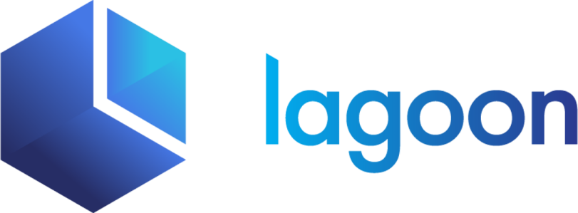

# Lagoon

## Lagoon - Kubernetes向けのオープンソースアプリケーションデリバリープラットフォーム { #lagoon-the-open-source-application-delivery-platform-for-kubernetes }

Lagoonは開発者が夢見るものを提供します。それは開発者がローカル環境と本番環境でまったく同じコードを実行することを可能にするシステムです。同じDockerイメージ、同じサービス設定、そして同じコード。

## どこから始めればいいですか？ { #where-do-i-start }

あなたがLagoonを使用してウェブサイトやアプリケーションをホストしたい場合は、[Lagoonの基本的な使い方](using-lagoon-the-basics/index.md)を参照してください。

Lagoonの機能についてより深く理解するためには、[Lagoonの高度な使い方](using-lagoon-advanced/index.md)をご覧ください。

Lagoonの仕組みを理解するためには、[Lagoonの概念 - 基本](concepts-basics/index.md)をチェックしてください。

そして、より深い理解のために、[Lagoonの概念 - 高度](concepts-advanced/index.md)をご覧ください。

あなたがLagoonを開発したい（機能を追加、バグを修正）場合は、[Lagoonの開発](contributing-to-lagoon/developing-lagoon.md)をご覧ください。

## TL;DR: Lagoonの仕組み { #tldr-how-lagoon-works }

1. 開発者は、YAML ファイル内で必要なサービスを定義および構成します。
2. 満足したら、コードを Git にプッシュします。
3. Lagoon は YAML ファイルを解析し、必要な追加構成を追加します。
4. Lagoon は必要な Docker イメージを構築します。
5. Lagoon はそれらを Docker レジストリにプッシュします。
6. Lagoon は Kubernetes に必要なリソースを作成します。
7. Lagoon はコンテナの展開を監視します。
8. すべてが完了すると、Lagoon はさまざまな方法 (Slack、メール、Web サイトなど) で開発者に通知します。

## Lagoonについて { #a-couple-of-things-about-lagoon }
1. **Lagoon はマイクロサービスに基づいています**。デプロイメントとビルドのワークフローは非常に複雑です。複数のバージョン管理ソース、複数のクラスター、複数の通知システムがあります。各デプロイメントは一意であり、数秒から数時間かかる場合があります。柔軟性と堅牢性を考慮して構築されています。マイクロサービスはメッセージング システムを介して通信するため、個々のサービスをスケールアップおよびスケールダウンできます。これにより、個々のサービスのダウンタイムを乗り切ることができます。また、他の部分に影響を与えることなく、本番環境で Lagoon の新しい部分を試すこともできます。
2. **Lagoon では多くのプログラミング言語が使用されています**。各プログラミング言語にはそれぞれ固有の長所があります。私たちは、各サービスに最も適した言語を決定するよう努めています。現在、Lagoon の多くは Node.js で構築されています。これは最初にNode.jsを使い始めたからだけでなく、Node.jsがwebhooks、タスクなどの非同期処理を可能にするからです。一部のサービスのプログラミング言語を変更することを考えています。これがマイクロサービスの素晴らしいところです！他のプラットフォームの部分を心配することなく、一つのサービスを別の言語で置き換えることができます。
3. **LagoonはDrupal特有のものではありません**。すべてが任意のDockerイメージを実行できるように構築されています。Drupal用の既存のDockerイメージがあり、DrushのようなDrupal特有のツールもサポートしています。しかし、それだけです！
4. **LagoonはDevOpsです**。開発者が必要なサービスを定義し、必要に応じてカスタマイズすることができます。これが正しい方法でないと思うかもしれませんし、開発者にあまりにも多くの権限を与えていると思うかもしれません。しかし、私たちはシステムエンジニアとして、開発者を強化する必要があると考えています。開発者がローカルでサービスを定義し、それらをローカルでテストすることを許せば、彼ら自身がバグやミスを見つけるでしょう。
5. **LagoonはDockerとKubernetes上で動作します。** \(それは明らかですよね?\)
6. **Lagoonは完全にローカルで開発・テストが可能です。**
7. **Lagoonは完全に統合テストされています**。これは私たちが 全プロセスをテストできます。Gitウェブフックの受信からDockerコンテナへのデプロイまで、同じGitハッシュがクラスタにデプロイされます。
8. **最も重要な点: これは進行中の作業です**。まだ完了していません。amazee.ioでは、ホスティングコミュニティとして、可能な限りコードを共有し、協力して作業を進める必要があると考えています。

私たちはあなたがLagoonのインフラストラクチャとサービスがどのように連携して動作するかを理解することを望んでいます。ここにスキーマがあります（少し古く、最近追加したサービスやKubernetesをカバーしていないので、更新作業中です！）：[Lucid Chart](https://lucid.app/documents/view/cb441054-e04a-4389-b98b-c75bcda8ea0d) ‌

## Lagoonの歴史 { #history-of-lagoon }

説明したように、Lagoonは夢が実現したものです。amazee.ioでは、Drupalを8年以上ホストしてきました。これは私たちのホスティングプラットフォームの4回目の大きな改訂です。3回目の改訂はPuppetとAnsibleを中心に構築されました。プラットフォームの各部分は全て設定管理で行われました。これにより新しいサーバーの設定が非常に速くできましたが、同時に開発者のカスタマイズの余地が不足していました。私たちはいくつかのカスタマイズを実装しましたが、すでにDockerを本番環境で使用していました。しかし、私たちは決して それに完全に満足していました。我々は、既存のプラットフォームだけでは足りないと気づきました。分離型Drupalの台頭、サーバーサイドでのNode.jsの動作要求、Elasticsearchへの要望、異なるSolrバージョンなど、我々はもっと進める必要がありました。

同時に、私たちは長年にわたり、ローカル開発のためにDockerを使用してきました。プロダクションで全てをDockerで行うというのは常に考えていました。唯一の問題は、ローカル開発とプロダクション環境間の接続でした。他にも、プロダクションでDrupalをDockerで動作させるシステムが存在します。しかし、ローカルとプロダクションで正確に同じイメージとサービスをテストすることを許可するものは何もありませんでした。

Lagoonは2017年に誕生しました。それ以来、プロダクションでDockerを動作させるシステムに発展しました。Lagoonは、我々の第3世代のホスティングプラットフォームを、最先端の全Dockerベースのシステムに置き換えました。

### オープンソース { #open-source }

amazee.ioでは、オープンソースを信じています。Drupalのようなオープンソースコードが独占的なホスティングプラットフォームでホストされていることは常に我々にとって問題でした。ホスティング会社の強さと成功は、単にデプロイメントシステムやサービスの設定だけではありません。それはプラットフォームを動かす人々と知識です。 プロセス、スキル、予期しない状況に対応する能力、そして最後に忘れてはならないのは、彼らがクライアントに提供するサポートです。

### ライセンス { #license }

Lagoonは、[`Apache 2.0 ライセンス`](https://github.com/uselagoon/lagoon/blob/main/LICENSE)の下で利用可能です。
