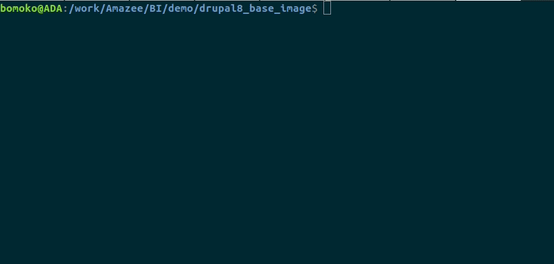
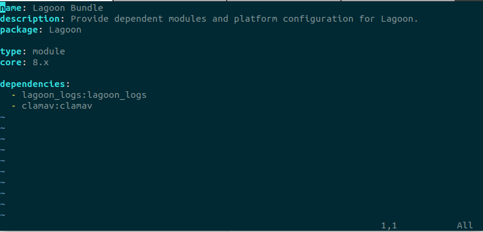
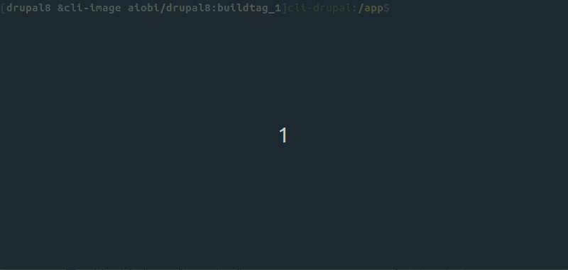
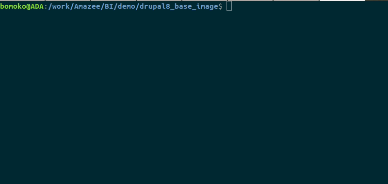
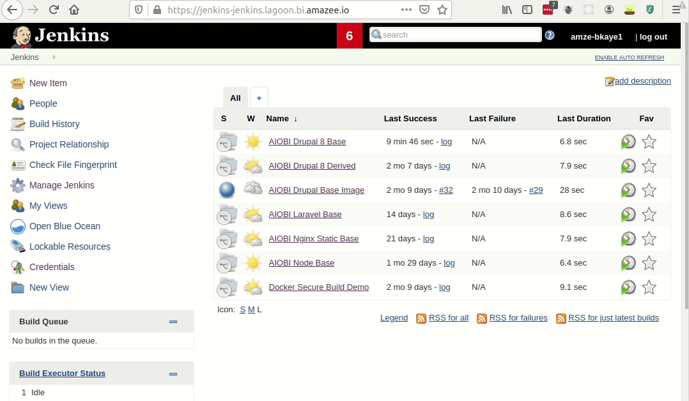
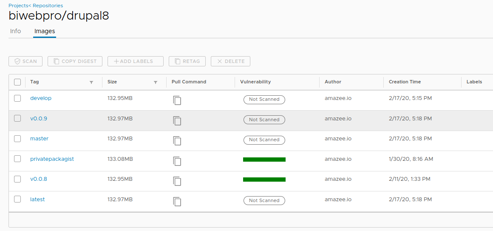

# ベースイメージ

## ベースイメージとは何ですか？

ベースイメージは、Lagoon上でデプロイされたプロジェクトが使用できる、または使用している[Docker](https://www.docker.com/)イメージです。ベースイメージは、監査されていないものが上流からコードベース/プロジェクトに持ち込まれないようにする方法を提供します。また、デプロイされた環境上で必要となる可能性のあるものがすべて利用可能であることを保証します - 低レベルのライブラリからアプリケーションレベルのテーマとモジュールまで。

ベースイメージは、どのシステムがデプロイされているかがわかっている場合、時間とリソースの節約に役立ちます - 共有パッケージがベースイメージに含まれている場合、それらを個々の数百のサイトにデプロイする必要はありません。

## 派生イメージ

派生イメージとは、ベースイメージを拡張するイメージのことを指します。例えば、いくつかのブログサイトを作る必要があるかもしれません。私たちのDrupalイメージを取り、ブログサイトに必要なモジュールとテーマすべてを含めてカスタマイズし、そのブログイメージですべてをデプロイします。テンプレートはベースイメージから派生します。

すべての派生イメージは、`composer.json`ファイルを（[Packagist](https://packagist.org/)、[Satis](https://github.com/composer/satis)、または[GitHub](https://github.com/)などのリポジトリ経由で）プルインする必要があります。これにより、それらは 基本パッケージの最新バージョン。

さらに、派生イメージには、`/build/pre_composer`スクリプトへの呼び出しが含まれています。これは、基本イメージが派生イメージでスクリプト、アップデートなどを実行するために使用できます。例えば、派生イメージでパッケージが更新またはインストールされると、デフォルトで実行され、`pre_composer`スクリプトはその後、基本イメージパッケージを更新します。

## 基本イメージの構造

!!! Info
    このドキュメントでは、DrupalやLaravelの基本イメージを例に取り上げます。これは、元々Lagoonプロジェクトでこれらのテクノロジーを使用しているクライアント向けに書かれたものです。他の基本イメージの内容もカバーするように拡張されますが、基本イメージの内容に関係なく、プロセスは変わりません。

基本イメージは、[Composer](https://getcomposer.org/)で管理され、[BitBucket](https://bitbucket.org/)、[GitHub](https://github.com/)、または[GitLab](https://gitlab.com/) \(チームが使用しているもの\)にホストされています。各基本イメージには独自のリポジトリがあります。

### メタパッケージ

メタパッケージは、複数の他のコンポーネントを包括するComposerパッケージです。これには、例えば、LaravelやDrupalのコアファイル、必要なモジュールなどが含まれます。 またはテーマ。これにより、プロジェクトの依存関係に Laravel や Drupal などを含める必要がありません。

以下は、Laravel ベースのイメージの `composer.json` からの例です：

```text title="composer.json"
"require": {
    "amazeelabs/algm_laravel_baseimage": "*"
},
```

私たちはこのメタパッケージだけを必要とし、これは GitHub のリポジトリを指しています。

### `docker-compose.yml`

プロジェクトの他の部分は [`docker-compose.yml`](../concepts-basics/docker-compose-yml.md) で定義されています。例えば、Drupal プロジェクトを持っている場合、Drupal のイメージが必要ですが、MariaDB、Solr、Redis、Varnish も必要です。これらのサービスのバージョンは Drupal に最適化されており、すべて `docker-compose.yml` に含まれています。

### Drupal

Drupal ベースのイメージには、Drupal コアに加えて以下の貢献ツールとモジュールが含まれています：

* [Drupal コンソール](https://drupalconsole.com/)
* [Drush](https://www.drush.org/)
* [設定インストーラ](https://www.drupal.org/project/config_installer)
* [Redis](https://www.drupal.org/project/redis)
* [Poll](https://www.drupal.org/project/poll)
* [Search API](https://www.drupal.org/project/search_api)
* [Search API Solr](https://www.drupal.org/project/search _api_solr)
* [Varnish Purge](https://www.drupal.org/project/varnish_purge)
* [Purge](https://www.drupal.org/project/purge)
* [Admin Toolbar](https://www.drupal.org/project/admin_toolbar)
* [CDN](https://www.drupal.org/project/cdn)
* [Password Policy](https://www.drupal.org/project/password_policy)
* [Pathauto](https://www.drupal.org/project/pathauto)
* [Ultimate Cron](https://www.drupal.org/project/ultimate_cron)

### Laravel

#### 設定

基本イメージは、Laravelで使用される環境変数のデフォルト値を提供しています。

これらは以下の値です：

* `DB_CONNECTION`
* `DB_HOST`
* `DB_PORT`
* `DB_DATABASE`
* `DB_USERNAME`
* `DB_PASSWORD`
* `REDIS_HOST`
* `REDIS_PASSWORD`
* `REDIS_PORT`

設定ファイル（通常は`/config`に位置しています）がこれらをデフォルトで使用するように確認してください。

#### キュー

プロジェクトが[キュー](https://laravel.com/docs/5.8/queues)を使用している場合、`artisan-worker`サービスを使用できます。これはワーカーコンテナで、[`artisan queue:work`](https://laravel.com/docs/5.8/queues#running-the-queue-worker)の実行に使用されます。これはデフォルトでは無効化されています - `docker-compose.yml`のコメントをご覧ください。

## ビルドプロセスの理解 ベースイメージ

ベースイメージを構築するプロセスにはいくつかの部分があります。主要なステップはすべてMakefileに記載されています。Jenkinsfileにはよりシンプルなビューが含まれています。これらのファイルを見ることで、このプロセス中に何が起こるかをよく理解することができます。ほとんどのステップはローカルでテストできます（これは新しいバージョンのベースイメージを構築する際に重要です）。ローカルで全てを作成し、テストした後にプッシュすると、実際のベースイメージは[Jenkins](https://jenkins.io/)によって構築され、[Harbor](../using-lagoon-advanced/using-harbor/README.md)にプッシュされます。

### Makefileとビルドの前提条件

ローカルで実行する予定の場合、少なくとも必要な環境変数が存在する必要があります。

### ベースイメージビルド変数

ベースイメージビルドプロセスに注入される変数と、それを見つける場所。

* `BUILD_NUMBER` - これは自動的にJenkinsによって注入されます。
* `GIT_BRANCH` - これはJenkinsのビルドプロセス自体によって提供されます。ビルド時にどのブランチが使用されるかによります（develop、mainなど）。
* `DOCKER_REPO`/`DOCKER_HUB` - これはJenkinsfile自体内で定義されています。これはDockerプロジェクトとハブを指しています。 生成された画像はプッシュされます。
* `DOCKER_USERNAME`/`DOCKER_PASSWORD` - これらは、ビルドの早い段階でDockerリポジトリに実際にログインするために使用されます。これらの変数はJenkinsの資格情報内に保存されます。これらはJenkinsfile自体で使用され、Makefileの一部ではありません。つまり、Jenkins以外の場所（つまり、ローカルでテストするなど）でベースイメージをビルドする場合、`docker login`を手動で実行する必要があります。

実際には、ローカルマシンで`make`ターゲットを実行している場合、これらが環境で利用可能であることを確認したいと思うでしょう - たとえば、コマンドラインからmakeを実行するときにこれらを設定するだけでも構いません：

```bash title="ローカルでmakeターゲットを設定する"
GIT_BRANCH=example_branch_name DOCKER_HUB=the_docker_hub_the_images_are_pushed_to DOCKER_REPO=your_docker_repo_here BUILD_NUMBER=<some_integer> make images_remove
```

### Makefile targets

最も重要なターゲットは以下の通りです：

* `images_build` : 環境変数を指定すると、画像をビルドしてタグを付けて公開します。
* `images_publish` : ビルドされた画像をDockerリポジトリにプッシュします。
* `images_start` : テストなどのためにイメージを開始します。
* `images_test`：イメージに対して基本的なテストを実行します。
* `images_remove`：ビルド環境変数が与えられると、以前にビルドされたイメージを削除します。

### ベースイメージの新リリースをビルドするための例のワークフロー

ビルドプロセスにはいくつかのステップがあります。これらのほとんどは、さまざまなベースイメージ間で共有されています。これらは主に上記で説明したMakefileターゲットに対応しています。

1. **Dockerログイン** - Dockerのユーザー名、パスワード、HarborのURLがDockerクライアントに渡されます。
2. **Dockerビルド** - `make images_build`ステップが現在実行されます。これにより以下のことが行われます：
   1. すべての環境変数がビルドの準備ができていることを確認します。
   2. `docker-compose build`を実行します。これにより、現在のGitブランチからいくつかの新しいDockerイメージが生成されます。
3. **イメージテスト** - これにより`make images_test`ターゲットが実行されます。これはテストされるイメージにより異なります。ほとんどの場合、これはイメージを開始し、何らかの方法で対話できることを確認する非常に直感的なテストです（Drupalのインストール、ファイルのリスト表示など）。
4. **Docker Push** - このステップでは、`images_publish`のmakeターゲットに含まれるロジックが実行され、その結果として生成されたイメージにタグが付けられます。 ステップ2の**Docker Build**でそれらをHarborにプッシュします。これについては、本ガイドの[他の場所](base-images.md#step-4-building-the-new-base-images)で詳しく説明されています。
5. **Docker Clean Images** - `images_remove`というmakeターゲットを実行し、これらがHarborにあるため、新しくビルドされたイメージをDockerホストから単純に削除します。

#### ベースイメージの新バージョンのリリース

ベースイメージの新バージョンをリリースする理由は多々あります。DrupalやLaravel、Node.jsなどのイメージでは、機能やセキュリティのためにモジュール/パッケージをアップグレードまたはインストールするためかもしれません。また、コンテナにバンドルされている基本ソフトウェアのバージョンを更新することもあります。例えば、PHPやNode.jsのバージョンを更新するなどです。また、ベースイメージがビルドされている実際の基本的な_イメージ_を更新することもあります。

あなたのプロジェクトのベースイメージがビルドされているイメージは、Lagoonチームによって管理されているイメージです。これらの基本イメージは月に一回（またはそれ以上）の頻度で更新されます。これらが更新されたとき、あなたはアップストリームのイメージにバンドルされている変更とアップグレードを取り入れるために、自分自身のベースイメージの新バージョンをビルドする必要があります。

このセクションでは、そのプロセスを示します。 Drupal 8基本イメージの新リリースを更新およびタグ付けします。我々は新しいモジュール（[ClamAV](https://www.drupal.org/project/clamav)）を基に追加します。Drupalをデモンストレーションするのは、基本イメージの中で最も複雑なセットアップを持っているからです。すべての基本イメージに共通する手順は以下に記載されています。

#### ステップ1 - 基本イメージをローカルにダウンロードする

これは単にGitリポジトリをローカルにダウンロードすることです。Drupal 8基本イメージの場合です。この例では、Bitbucketを使用しているので、次のコマンドを実行します：

```bash title="Clone Git repo."
git clone ssh://git@bitbucket.biscrum.com:7999/webpro/drupal8_base_image.git
```


#### ステップ2 - リポジトリに変更を加える

!!! Info
    ここで示されていることはDrupal 8基本イメージに特有のものです。しかし、変更（ファイルの追加、基本的なDockerイメージの変更など）はすべての基本イメージでこのステップで行われます。

我々の例では、ClamAVモジュールをDrupal 8基本イメージに追加しています。これにはいくつかのステップが関与します。最初はパッケージを必要とすることで、これにより我々の`composer.json`ファイルに追加されます。これは`composer require`を実行することで行われます。

ここで我々は実行します： ```bash title="Composer requireでパッケージをインストールする。"
composer require drupal/clamav
```

Composer requireのプロセスが完了すると、パッケージは`composer.json`ファイルに表示されるべきです。
ここでは、`composer.json`ファイルを開き、必要なパッケージのリストを見て、ClamAVパッケージがリストされていることを確認し、それがそこにあることを確認します：

#### ステップ2.2 - テンプレートベースの派生イメージで必要なDrupalモジュールが有効になっていることを確認する
ベースイメージに追加された任意のモジュールは、テンプレートベースの派生イメージで有効にする必要があります。これは、モジュールをLagoon Bundleモジュールに追加することで行われます。これは具体的には、`dependencies`セクションの`lagoon_bundle.info.yml`ファイルに依存性として追加することを要求します。Lagoon Bundleモジュールは、派生イメージ間の依存関係を強制するためだけに存在するユーティリティモジュールです。
ここでは、`web/modules/contrib/lagoon/lagoon_bundle/lagoon_bundle.info.yml`を開き、`clamav:clamav`を追加します。  依存関係:

これに依存関係を追加することで、派生したイメージ上でLagoon Bundleモジュールが有効になるたびに、その依存関係（この場合、新たに追加されたClamAVモジュール）も有効になることを保証します。これは、ロールアウト時に`lagoon_bundle`を派生イメージで有効にするポストロールアウトスクリプトで強制されます。
#### ステップ2.3 - テスト
これはあなたが何をテストしているかによります。ClamAVモジュールを追加する場合、ベースイメージでモジュールがダウンロードされ、Lagoon Bundleモジュールが有効化されたときにClamAVも有効化されることを確認したいと考えています。
ここでは、モジュールが`/app/web/modules/contrib`にダウンロードされたことを確認します：

そして、`lagoon_bundle`モジュールを有効化するときに、`clamav`も有効化されることを確認するために、以下のコマンドを実行します：
```bash title="Drushでモジュールを有効化する。"
drush pm-enable lagoon_bundle -y
```


!!! 警告
    上記のコンテナでJWTエラーが発生していることが分かるでしょう。これは安全に無視することができます 上記のデモンストレーションでは、背景として、あなたが作業しているサイトのためのラグーン環境が存在しない場合にこのエラーが表示されます。

テストが終了したので、イメージをタグ付けしてビルドすることができます。

#### ステップ3 - イメージのタグ付け

イメージは、[Gitタグ](https://git-scm.com/docs/git-tag)に基づいてバージョン管理されます - これらは標準的な[セマンティックバージョニング](https://semver.org/)（semver）の実践に従うべきです。すべてのタグは **vX.Y.Z** の構造を持つべきであり、X、Y、Zは整数です（正確にはX.Y.Z自体がセマンティックバージョンであり、vX.Y.Zはタグです）。これはイメージタグを決定するために使用される仮定であるため、_必ず_ それに従う必要があります。

この例では、ClamAVを追加したことを示すDrupal 8ベースイメージの新しいバージョンをタグ付けします。

#### ここでは、イメージのタグ付け方法を示します

私たちは、`git log`を使用して、通常のコミットやプッシュと同じように、変更をコミット（しかしプッシュはしない）したことを確認します。

1. まだ変更をコミットしていなければ、コミットします。
2. 次に、`git tag`を使用して、どのタグにいるのかを確認します。
3. 次に、`git tag -a v0.0.9 -m “Adds clamAV to base.”`を使用してタグ付けします。
   1. _git -a, --annotate: 署名なし、注釈付きのタグを作成します。 オブジェクト_
4. 次に、`git push --tags`で我々のタグをプッシュします。
5. 最後に、`git push`で我々の全ての変更をプッシュします。

!!! 危険
    タグはそれ自体のステップで明示的にプッシュされなければなりません！



#### Gitのタグがイメージのタグにどのようにマッピングされるか

!!! 危険
    ビルドワークフローによりますが、ほぼ確実に**develop**ブランチ経由で変更をプッシュし、それを**main**ブランチにマージするでしょう。

ここで覚えておくべき重要な点は、Jenkinsのベースイメージのビルドプロセスは、_最新のコミットタグ_に基づいて_イメージ_をタグ付けするということです。

イメージは以下のルールでタグ付けされ、これに該当するものごとにイメージがビルドされます：

1. **main**ブランチがビルドされると、`latest`としてタグ付けされます。
2. developブランチがビルドされると、`development`としてタグ付けされます。
3. ビルドされるコミットが_タグ付け_されていれば、そのブランチはそのコミットのタグ付けでビルドされます。
   1. これは我々が上で示した新しいバージョンをリリースする方法です。これはまた、かなり任意のタグでアドホックなビルドを行うためにも使用できます - タグ名は適切であるべきです、それは_セマンティックバージョニング_のタグでのみテストされています。

#### ステップ4 - 新しいベースイメージのビルド

!!! 情報 一般的には、自動ビルドのためのトリガー戦略がここに設定されていますが、それはあなたのニーズや設定によって異なるため、ここでは手動でビルドする方法を説明します。

1. あなたのLagoon Jenkinsインスタンスを訪れます。
2. 作業中のプロジェクト（この場合、AIOBI Drupal 8 Base）を選択します。
3. ビルドしたいブランチをクリックします。
4. 「Build Now」をクリックします。



これにより、ビルドプロセスが開始され、成功すれば新しいイメージをHarborにプッシュします。

ビルドが成功しない場合は、ビルド自体をクリックしてログを読み、どこで失敗したかを理解することができます。

下のHarborからのスクリーンショットで示されているように、私たちがJenkinsでビルドしたばかりのイメージはHarborにアップロードされ、タグ付けされています。ここでは、それがv0.0.9とタグ付けされているため、そのタグのついたイメージが存在します。また、私たちは**main**ブランチをビルドしたので、「latest」イメージもビルドされました。この段階では、v0.0.9と「latest」のイメージは同一です。



## 謝辞

ベースイメージの構造は、実際には、 [Denpal](https://github.com/dennisarslan/denpal)のフォークです。これは元の[Drupal Composer Template](https://github.com/drupal-composer/drupal-project)に基づいていますが、Lagoon（ローカル開発環境またはホストされたLagoon）で実行するために必要なすべてを含んでいます。
