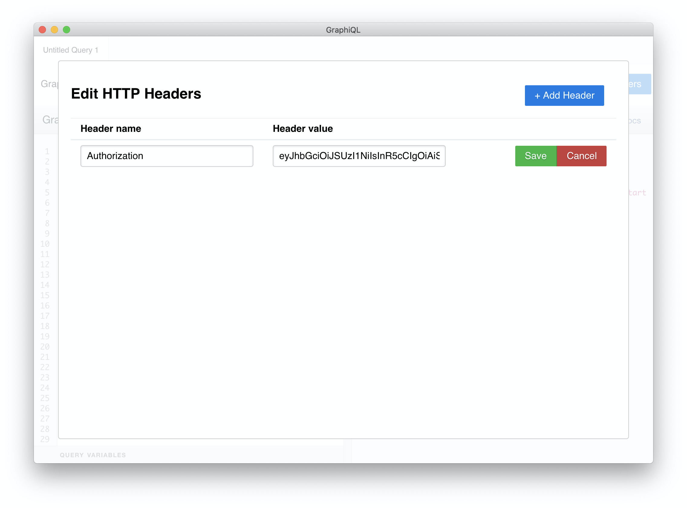
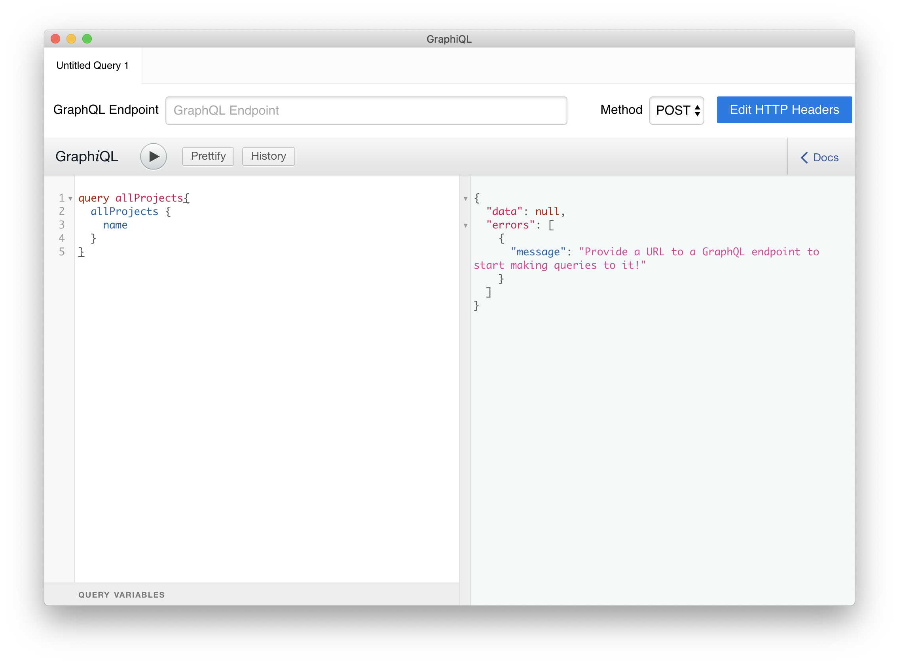

# GraphQL API

## GraphQLクエリの実行

Lagoonでの直接的なAPIの相互作用は、[GraphQL](graphql-queries.md)を経由して行われます。

APIとの認証を行うためには、私たちが管理者としてGraphQL APIを使用できるようにするJWT(JSON Web Token)が必要です。このトークンを生成するには、Kubernetes UI経由、またはkubectlを使用して`storage-calculator`ポッドのターミナルを開き、次のコマンドを実行します:

```bash title="JWTトークンの生成"
./create_jwt.py
```

これによりJWTトークンである長い文字列が返されます。これはクエリを送信するために必要となるので、メモしておいてください。

また、APIエンドポイントのURLも必要です。これはKubernetes UIの"Ingresses"の下、またはコマンドラインのkubectlを経由して見つけることができます。このエンドポイントURLも必要になるので、メモしておいてください。

GraphQLクエリを作成し送信するには、自動補完機能などを備えたデスクトップGraphQLクライアントである[GraphiQL.app](https://github.com/skevy/graphiql-app)をお勧めします。次の手順に進むには、このアプリをインストールし起動します。

"GraphQL Endpoint"の下に`/graphql`を末尾に付けたAPIエンドポイントURLを入力します。次に"Edit HTTP Headers"をクリックし、新しいヘッダーを追加します:

* "ヘッダー名":`Authorization`
* "ヘッダー値":`Bearer [JWTトークン]` (確認してください JWTトークンにスペースがないこと(スペースが含まれていると動作しません)

ESCキーを押してHTTPヘッダーオーバーレイを閉じ、最初のGraphQLリクエストを送信する準備ができました！



これを左パネルに入力します

```graphql title="クエリの実行"
query allProjects{
  allProjects {
    name
  }
}
```



そして、▶️ボタンを押すか(またはCTRL+ENTERを押す)。

すべてがうまくいけば、最初のGraphQLレスポンスがすぐに右のペインに表示されるはずです。

## 最初のプロジェクトの作成

Lagoonにデプロイするための最初のプロジェクトを作成しましょう！これには、[`create-project.gql`](../interacting/create-project.gql)のGraphQLクエリテンプレートからクエリを使用します。

各クエリ(`mutation {`で始まるブロック)について、TODOコメントでマークされた空のフィールドをすべて埋めて、GraphiQL.appでクエリを実行します。これにより、以下の2つのオブジェクトがそれぞれ1つずつ作成されます:

1. `kubernetes` : LagoonがデプロイするべきKubernetes(またはOpenshift)クラスタ。Lagoonは自身のKubernetesクラスタにだけでなく、任意のKubernetesにもデプロイすることが可能です。 世界中のどこでもクラスタリングします。
2. `project` : デプロイされるLagoonプロジェクトで、ルートにコミットされた `.lagoon.yml` 設定ファイルを持つGitリポジトリです。

## プロジェクトへのアクセス許可

Lagoonでは、各開発者は自分のSSHキーで認証します。これにより、以下へのアクセスが決まります:

1. 自分がアクセス権を持つプロジェクトを見て編集できるLagoon API。
2. 自分がアクセス権を持つプロジェクトで実行中のコンテナへのリモートシェルアクセス。
3. リクエストログ、コンテナログ、Lagoonログなどを見つけることができるLagoonのログシステム。

プロジェクトへのアクセスを許可するためには、まずAPIに新しいグループを追加する必要があります:

```graphql title="APIにグループを追加"
mutation {
  addGroup (
    input: {
      # TODO: 新しいグループの名前を入力してください。
      name: ""
    }
  )     {
    id
    name
  }
}
```

次に、APIに新しいユーザーを追加する必要があります:

```graphql title="APIに新規ユーザーを追加"
mutation {
  addUser(
    input: {
      email: "michael.schmid@example.com"
      firstName: "Michael"
      lastName: "Schmid"
      comment: "CTO"
    }
  ) {
    # TODO: 返されたユーザーIDをメモしておいてください。
    id
  }
}
```

それから、その APIにユーザーを追加:

```graphql title="APIにSSH公開鍵を追加する"
mutation {
  addSshKey(
    input: {
      # TODO: nameフィールドを記入して下さい。
      # これはSSHキーの非一意な識別子です。
      name: ""
      # TODO: keyValueフィールドを記入して下さい。
      # これは実際のSSH公開鍵です(最初のタイプと最後のコメントを除いて、例 `AAAAB3NzaC1yc2EAAAADAQ...3QjzIOtdQERGZuMsi0p`)。
      keyValue: ""
      # TODO: keyTypeフィールドを記入して下さい。
      # 有効な値は、SSH_RSA、SSH_ED25519、ECDSA_SHA2_NISTP256/384/521のいずれかです。
      keyType: SSH_RSA
      user: {
        # TODO: userIdフィールドを記入して下さい。
        # これはaddUserクエリから取得したユーザーIDです。
        id:"0",
        email:"michael.schmid@example.com"
      }
    }
  ) {
    id
  }
}
```

キーを追加した後、ユーザーをグループに追加する必要があります:

```graphql title="ユーザーをグループに追加する"
mutation {
  addUserToGroup (
    input: {
      user: {
        #TODO: ユーザーのメールアドレスを入力してください。
        email: ""
      }
      group: {
        #TODO: ユーザーを追加したいグループの名前を入力してください。
        name: ""
      }
      #TODO: ユーザーの役割を入力してください。 .
      role: OWNER

    }
  ) {
    id
    name
  }
}
```

これらのクエリの一部または全部を実行した後、ユーザーはSSH経由でトークンを作成したり、コンテナにアクセスしたりする権限が付与されます。

## プロジェクトに通知を追加する

デプロイメント中に何が起こっているのかを知りたい場合、プロジェクトに通知を設定することをお勧めします。以下の情報を提供します:

* プッシュ通知
* ビルド開始情報
* ビルド成功または失敗メッセージ
* その他多数！

通知は、必要な情報の点でかなり異なる可能性があるため、各通知タイプには独自の変異があります。

ユーザーと同様に、まず通知を追加します:

```graphql title="通知を追加する"
mutation {
  addNotificationSlack(
    input: {
      # TODO: 名前フィールドを記入してください。
      # これは通知のための自身の識別子です。
      name: ""
      # TODO: チャンネルフィールドを記入してください。
      # これはメッセージが送信されるチャンネルです。
      channel: ""
      # TODO: ウェブフックフィールドを記入してください。
      # これはメッセージが送信されるべきウェブフックのURLで、通常はチャットシステムから提供されます。
      webhook: ""
    }
  ) {
    id
  }
}
```

通知が作成された後、 これで、私たちのプロジェクトに割り当てることができます:

```graphql title="プロジェクトに通知を割り当てる"
mutation {
  addNotificationToProject(
    input: {
      notificationType: SLACK
      # TODO: プロジェクトフィールドを記入してください。
      # これはプロジェクトの名前です。
      project: ""
      # TODO: 通知フィールドを記入してください。
      # これは通知の名前です。
      notificationName: ""
      # TODO: オプション
      # 興味のある通知クラスの種類は、デフォルトでDEPLOYMENTになります
      contentType: DEPLOYMENT/PROBLEM
      # TODO: オプション
      # contentType PROBLEMに関連して、我々が通知を受けたい問題の種類の閾値を設定することができます
      notificationSeverityThreshold: "NONE/UNKNOWN/NEGLIGIBLE/LOW/MEDIUM/HIGH/CRITICAL
    }
  ) {
    id
  }
}
```

これで、デプロイメントごとに、定義したチャンネルでメッセージを受け取ることができます。

## GraphQLクエリの例

### 新しいKubernetesターゲットの追加

!!! Note "注意:"
    Lagoonでは、`addKubernetes`と`addOpenshift`のどちらもKubernetesとOpenShiftのターゲットの両方に使用することができ、どちらも互換性があります。

Lagoonがデプロイするべきクラスタ。

```graphql title="Kubernetesターゲットの追加"
mutation {
  addKubernetes(
    input: {
      # TODO: 名前フィールドを記入してください。
      # これはクラスタの一意の識別子です。
      name: ""
      # TODO: consoleUrlフィールドを記入してください。
      # これはKubernetesクラスタのURLです
      consoleUrl: ""
      # TODO: トークンフィールドを記入してください。
      # これは、このクラスタで作成された`lagoon`サービスアカウントのトークンです(これは、Lagoonのインストール時にも使用したのと同じトークンです)。
      token: ""
    }
  ){
    name
    id
  }
}
```

### プロジェクトにグループを追加する

このクエリはプロジェクトにグループを追加します。そのグループのユーザーはプロジェクトにアクセスできます。彼らはそのグループでの役割に基づいて変更を加えることができます。

```graphql title="プロジェクトにグループを追加する"
mutation {
  addGroupsToProject (
    input: {
      project: {
        #TODO: プロジェクトの名前を入力してください。
        name: ""
      }
      groups: {
        #TODO: プロジェクトに追加されるグループの名前を入力してください。
        name: ""
      }
    }
  ) {
    id
  }
}
```

### 新しいプロジェクトを追加する

このクエリは、新しいLagoonプロジェクトをデプロイするために追加します。これは、ルートにコミットされた`.lagoon.yml`設定ファイルを持つGitリポジトリです。

もし `privateKey` フィールドがある場合、プロジェクトの新しいSSHキーが自動的に生成されます。

別のプロジェクトからキーを再利用したい場合は、`addProject` ミューテーションでキーを提供する必要があります。

```graphql title="新しいプロジェクトを追加"
mutation {
  addProject(
    input: {
      # TODO: 名前フィールドを入力してください。
      # これはプロジェクト名です。
      name: ""
      # TODO: プライベートキーフィールドを入力してください(改行は '\n' で置き換えてください)。
      # これはプロジェクトのプライベートキーで、Gitのコードにアクセスするために使用されます。
      privateKey: ""
      # TODO: Kubernetesフィールドを入力してください。
      # これはプロジェクトに割り当てるKubernetesまたはOpenShiftのIDです。
      kubernetes: 0
      # TODO: 名前フィールドを入力してください。
      # これはプロジェクト名です。
      gitUrl: ""
      # TODO: デプロイするブランチを入力してください。
      branches: ""
      # TODO: 本番環境を定義してください。
      productionEnvironment: ""
    }
  ) {
    name
    kubernetes {
      name
      id
    }
    gitUrl
    branches
    pullrequests
  }
}
```

### プロジェクトとグループのリスト

これは、私たちのLagoon内に存在するすべてのプロジェクト、クラスター、グループの概要を見るための良いクエリです。

```graphql title=" すべてのプロジェクト、クラスター、およびグループの概要を取得"
query {
  allProjects {
    name
    gitUrl
  }
  allKubernetes {
    name
    id
  }
  allGroups{
    id
    name
    members {
      # これはこのグループのユーザーを表示します。
      user {
        id
        firstName
        lastName
      }
      role
    }
    groups {
      id
      name
    }
  }
}
```

### 単一のプロジェクト

単一のプロジェクトを詳しく見る場合、このクエリが非常に有用であることが証明されています。

```graphql title="プロジェクトを詳しく見る"
query {
  projectByName(
    # TODO: プロジェクト名を入力してください。
    name: ""
  ) {
    id
    branches
    gitUrl
    pullrequests
    productionEnvironment
    notifications(type: SLACK) {
      ... on NotificationSlack {
        name
        channel
        webhook
        id
      }
    }
    environments {
      name
      deployType
      environmentType
    }
    kubernetes {
      id
    }
  }
}
```

### Git URLによるプロジェクトのクエリ

プロジェクトの名前を覚えていないが、Git URLは知っている場合？もう探す必要はありません、そのためのGraphQLクエリがあります:

```graphql title="Git URLによるプロジェクトのクエリ"
query {
  projectByGitUrl(gitUrl: "git@server.com:org/repo ```
.git") {
    name
  }
}
```

### オブジェクトの更新

Lagoon GraphQL APIは、オブジェクトを表示し、オブジェクトを作成するだけでなく、[パッチオブジェクト](https://blog.apollographql.com/designing-graphql-mutations-e09de826ed97)を使用して既存のオブジェクトを更新する能力もあります。

プロジェクト内でデプロイするブランチを更新します。

```graphql title="デプロイブランチの更新。"
mutation {
  updateProject(
    input: { id: 109, patch: { branches: "^(prod|stage|dev|update)$" } }
  ) {
    id
  }
}
```

プロジェクト内の本番環境を更新します。

!!! Warning "警告"
    この変更をコンテナに反映させるには、再デプロイが必要です。

```graphql title="本番環境の更新"
 mutation {
   updateProject(
    input: { id: 109, patch: { productionEnvironment: "main" } }
  ) {
    id
  }
}
```

また、一度に複数の変更を組み合わせることもできます。

```graphql title="本番環境の更新とデプロイブランチの設定。"
mutation {
  updateProject(
    input: {
      id: 109
      patch: {
        productionEnvironment: "main"
        branches: "^(prod|stage|dev|update)$"
      }
    }
  ) {
    id
  }
}
```

### 環境の削除

Lagoon GraphQL APIを使用して、環境を削除することもできます。 環境。コマンドを実行するためには、プロジェクト名と環境名を知っている必要があります。

```graphql title="環境を削除する"
mutation {
  deleteEnvironment(
    input: {
      # TODO: nameフィールドを記入してください。
      # これは環境名です。
      name: ""
      # TODO: projectフィールドを記入してください。
      # これはプロジェクト名です。
      project: ""
      execute:true
    }
  )
}
```

### プロジェクトに割り当てられたグループとユーザーを確認する

プロジェクトにどのグループとユーザーがアクセスできるか見たいですか？彼らの役割は何か知りたいですか？そのためのクエリがあります！下記のクエリを使用して、プロジェクトを検索し、そのプロジェクトに割り当てられたグループ、ユーザー、役割を表示できます。

```graphql title="プロジェクトに割り当てられたグループ、ユーザー、役割をクエリする"
query search{
  projectByName(
    #TODO: プロジェクトの名前を入力してください。
    name: ""
  ) {
    id,
    branches,
    productionEnvironment,
    pullrequests,
    gitUrl,
    kubernetes {
      id
    },
     groups{
      id
      name
      groups {
        id
        name
      }
      members {
        role
        user {
          id
          email
        }
      }
    }
  }
}
```

## 維持 プロジェクトメタデータ

プロジェクトメタデータは、任意のキー/値の組み合わせで割り当てることができます。プロジェクトは関連付けられたメタデータによって問い合わせることができます。例えば、ソフトウェアの種類、バージョン番号、または後で問い合わせるための任意のカテゴリーによってプロジェクトを分類することができます。

### プロジェクトのメタデータを追加/更新する

メタデータの更新はキー/値の組み合わせを期待しています。これは`UPSERT`として動作します。つまり、既にキーが存在する場合は値が更新され、存在しない場合は挿入されます。

プロジェクトに対して任意の数のk/vペアを保存することができます。

```graphql title="メタデータにキー/値のペアを追加する"
mutation {
  updateProjectMetadata(
    input: { id: 1,  patch: { key: "type", value: "saas" } }
  ) {
    id
    metadata
  }
}
```

### メタデータによるプロジェクトのクエリ

クエリは`key`のみ(例:特定のキーが存在するすべてのプロジェクトを返す)または`key`と`value`の両方(キーと値の両方が一致する必要があります)によって行うことができます。

`version`タグを持つすべてのプロジェクト:

```graphql title="メタデータによるクエリ"
query projectsByMetadata {
  projectsByMetadata(metadata: [{key: "version"] ) {
    id
    name
  }
}
```

特にバージョン`8`の`version`タグを持つすべてのプロジェクト:

```graphql title="メタデータによるクエリ"
query projectsByMetadata {
  projectsByMetadata(metadata: [{key: "version", value: "8"] ) {
    id
    name
  }
}
```

### プロジェクトのメタデータを削除する

メタデータはキーごとに削除できます。他のメタデータキー/値のペアは残ります。

```graphql title="メタデータを削除する"
mutation {
  removeProjectMetadataByKey (
    input: { id: 1,  key: "version" }
  ) {
    id
    metadata
  }
}
```
